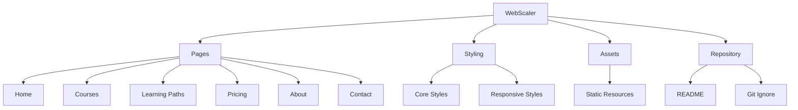

<div align="center">

# WebScaler

### A responsive multi-page learning platform for structured software engineering journeys.

<br>

[](https://saikiran-ravuri.github.io/webscaler/)
[](https://github.com/saikiran-ravuri/webscaler)

</div>

---

## About

WebScaler is a frontend learning-platform project built as a complete multi-page website.

It brings course exploration, goal-based learning paths, pricing, platform information, and learner support into a consistent and responsive web experience.

---

## Pages

| Page | Purpose |
| --- | --- |
| **Home** | Platform overview and learning journey |
| **Courses** | Structured modules and course exploration |
| **Learning Paths** | Goal-based software engineering roadmaps |
| **Pricing** | Clear learning plan comparison |
| **About** | Platform purpose and values |
| **Contact** | Learner support and contact interface |

---

## Tech Stack

<div align="center">


<br><br>

`Semantic HTML` · `CSS Grid` · `Flexbox` · `Responsive Design` · `GitHub Pages`

</div>

---

## Project Architecture



<details>
<summary><strong>View file structure</strong></summary>

```text
WebScaler/
├── assets/
├── css/
│   ├── style.css
│   └── responsive.css
├── index.html
├── courses.html
├── paths.html
├── pricing.html
├── about.html
├── contact.html
├── .gitignore
└── README.md
```

</details>

---

## Engineering Highlights

- Semantic multi-page HTML structure
- Reusable UI patterns and shared components
- Responsive layouts with CSS Grid and Flexbox
- Consistent navigation and visual hierarchy
- Dedicated responsive styling for multiple screen sizes
- Organized separation of core and responsive styles
- Git-based version control workflow
- Live deployment with GitHub Pages

---

## Run Locally

Clone the repository:

```bash
git clone https://github.com/saikiran-ravuri/webscaler.git
```

Open the `webscaler` folder and launch `index.html` in your browser.

---

## Roadmap

- JavaScript-powered interactions
- Client-side form validation
- Interactive mobile navigation
- Dynamic course filtering
- Accessibility improvements

---

## Author

**Ravuri Sai Kiran**

[](https://github.com/saikiran-ravuri)
